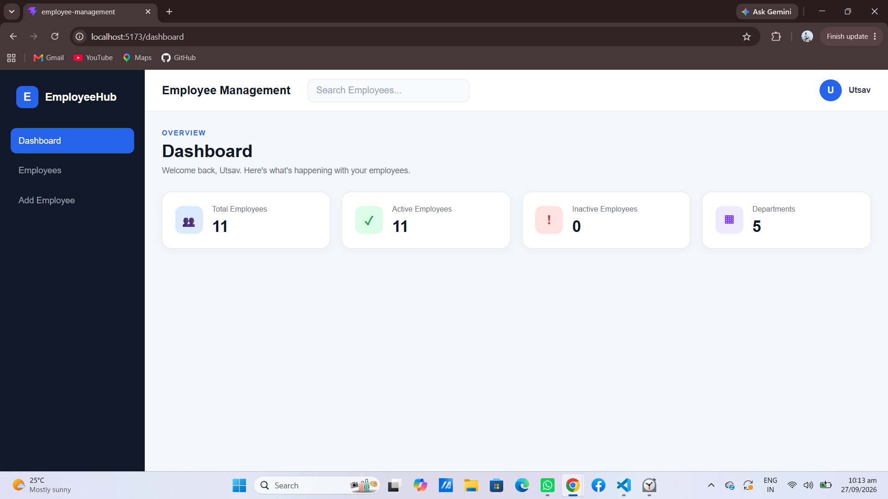
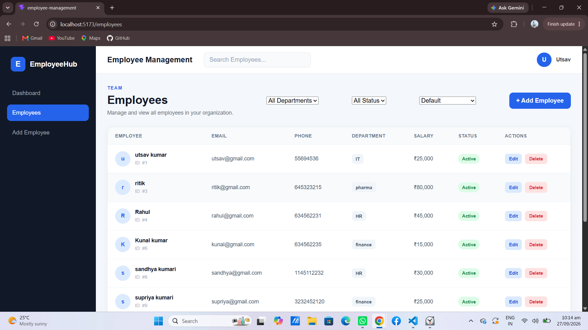
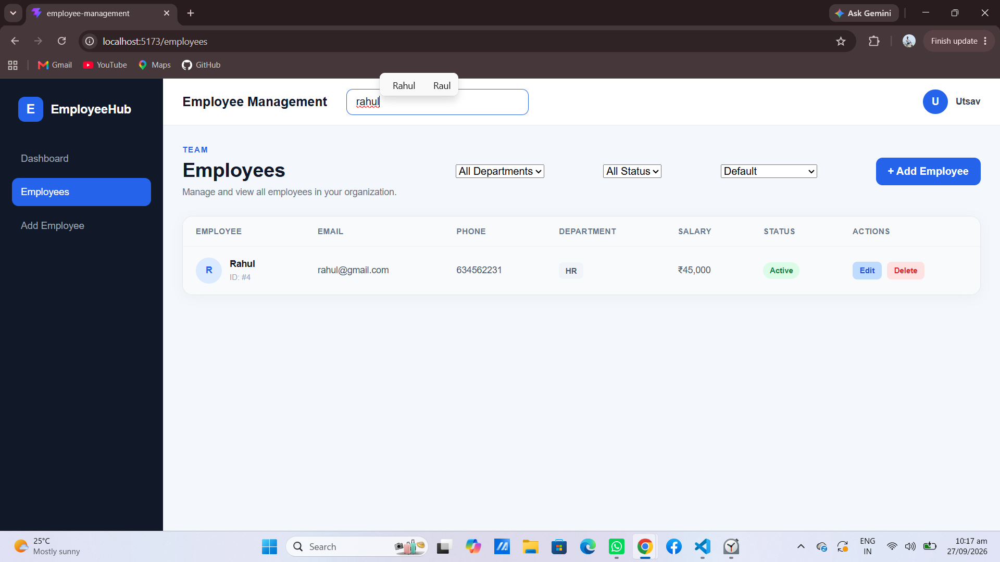
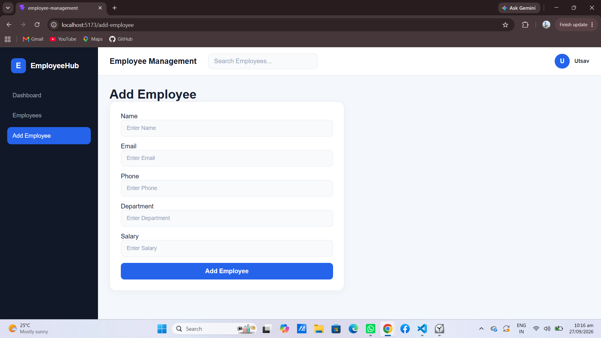
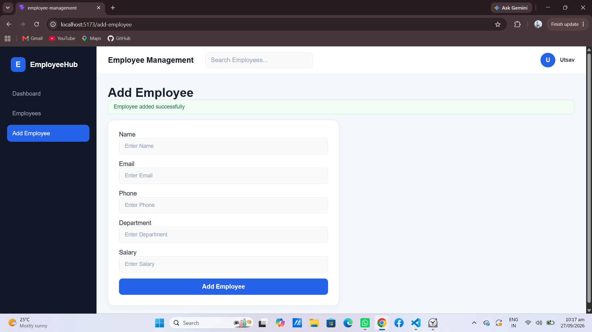
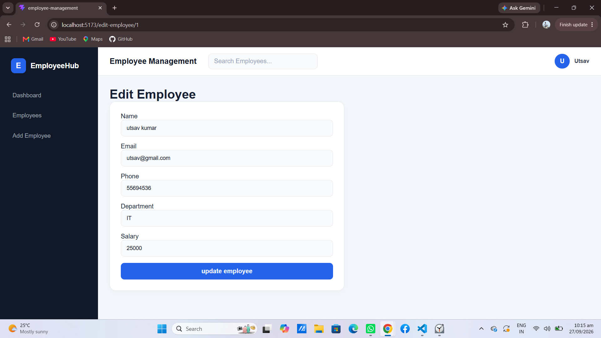
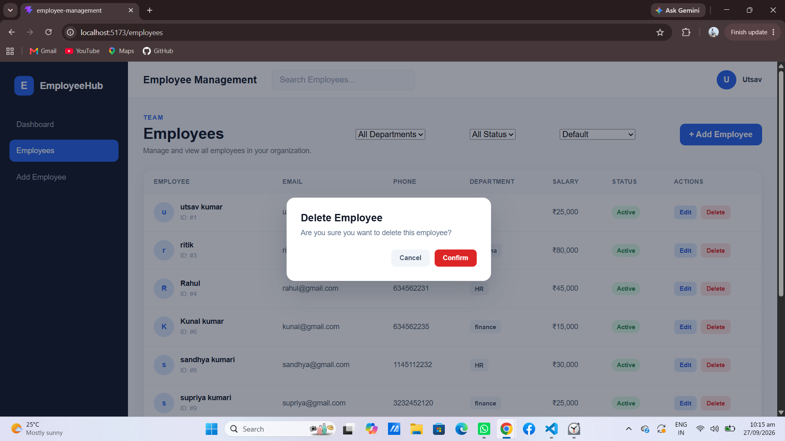

# Employee Management System

A responsive employee management web application built with React.js and JSON Server, featuring complete CRUD functionality, search, filtering, sorting, and a dynamic dashboard.

## Screenshots

### Dashboard

### Employees List

### Search Employee

### Add Employee

### Add Employee Success

### Update Employee

### Delete Employee

## Features
- Add, edit, delete employees (CRUD)
- Search, filter by department/status, and sort
- Form validation with error messages
- Delete confirmation modal
- Dashboard with live employee statistics

## Tech Stack
React.js, React Router, JSON Server, CSS3

## Live Demo
[Add your live link here]

## Getting Started
\`\`\`bash
git clone <your-repo-url>
cd employee-management-system
npm install
npm run dev
\`\`\`

In a separate terminal, run the mock backend:
\`\`\`bash
npx json-server --watch db.json --port 5000
\`\`\`